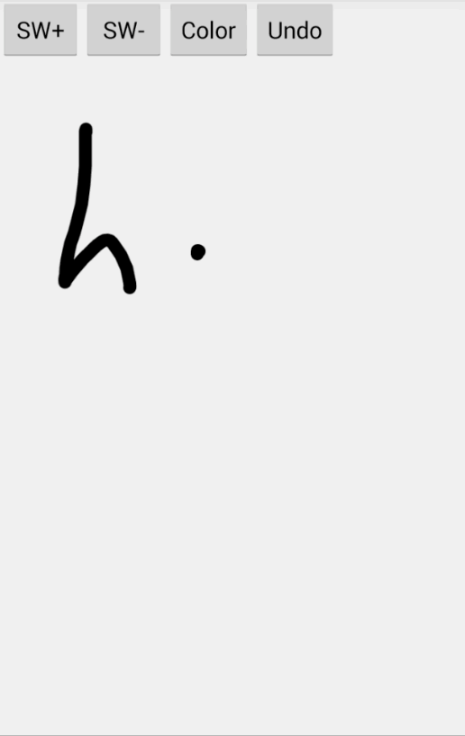

# Android Drawable View 
[](https://android-arsenal.com/details/1/1510) 


## Sample app:



An Android view that allows to paint with a finger in the screen and saves the result as a Bitmap.

## Importing to your project
Add this dependency to your build.gradle file:

```java
dependencies {
    compile 'me.panavtec:drawableview:{Lib version, see the mvn central badge}'
}
```

## Basic usage
Add the view to your xml layout in this way:

```xml
<me.panavtec.drawableview.DrawableView
        android:id="@+id/paintView"
        android:layout_width="match_parent"
        android:layout_height="match_parent"/>
```

Now in your activity code set a config to this view:

```java
DrawableViewConfig config = new DrawableViewConfig();
config.setStrokeColor(getResources().getColor(android.R.color.black));
config.setShowCanvasBounds(true); // If the view is bigger than canvas, with this the user will see the bounds (Recommended)
config.setStrokeWidth(20.0f);
config.setMinZoom(1.0f);
config.setMaxZoom(3.0f);
config.setCanvasHeight(1080);
config.setCanvasWidth(1920);
drawableView.setConfig(config);
```

Now the view is ready to paint! You can see the attached sample for more info

To save the results of the view to a Bitmap just call:

```java drawableView.obtainBitmap()```


ChangeLog
=========
**0.6**

\[**Bug/Improvement**] When the view is bigger than the canvas (config width/height) now I'm showing a rect and don't allow user to draw outside the canvas.

\[**Improvement**] Added obtainBitmap(Bitmap method) to draw inside an already created Bitmap

**0.5**

Initial version

Developed by
============
Christian Panadero Martinez - <a href="http://panavtec.me">http://panavtec.me</a> - <a href="https://twitter.com/panavtec">@PaNaVTEC</a>

Carlos Morera de la Chica - <a href="https://twitter.com/CarlosMChica">@CarlosMChica</a>

License
=======

    Copyright 2015 Christian Panadero Martinez

    Licensed under the Apache License, Version 2.0 (the "License");
    you may not use this file except in compliance with the License.
    You may obtain a copy of the License at

       http://www.apache.org/licenses/LICENSE-2.0

    Unless required by applicable law or agreed to in writing, software
    distributed under the License is distributed on an "AS IS" BASIS,
    WITHOUT WARRANTIES OR CONDITIONS OF ANY KIND, either express or implied.
    See the License for the specific language governing permissions and
    limitations under the License.
